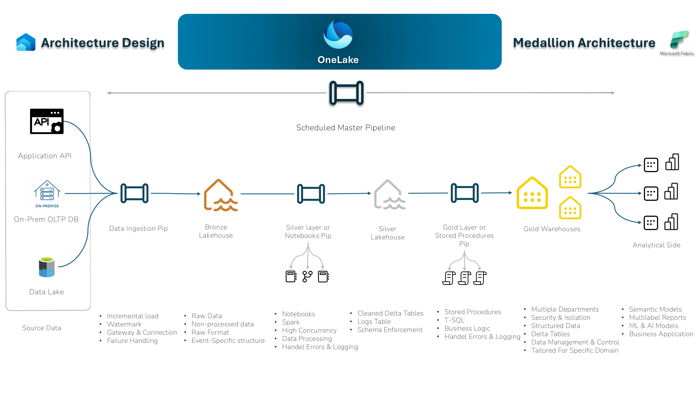

# End-to-End Architecture and Solution Using Microsoft Fabric

## Overview

This project aims to build an end-to-end architecture and solution utilizing Microsoft Fabric for data ingestion, processing, and storage. The solution incorporates a Medallion Architecture model, with data flowing through various layers and supporting multiple data sources. The entire process will be automated using pipelines, ensuring incremental loading and daily updates to lakehouses and warehouses.

### Key Components:

1. **Data Ingestion**: The solution ingests data from three different sources:
   - **API**: Data pulled from external APIs.
   - **On-premises**: Data sourced from on-premises systems.
   - **Data Lake**: Data gathered from an existing data lake.

2. **Medallion Architecture**: We implement the Medallion Architecture to streamline data processing across multiple layers:
   - **Bronze Layer**: Raw data stored in a Lakehouse.
   - **Silver Layer**: Cleaned and structured data stored in a Lakehouse.
   - **Gold Layer**: Refined, business-ready data stored in a multi-table data warehouse. This layer supports multiple departments and domains.

3. **Data Processing**: Data processing is conducted using notebooks, leveraging PySpark capabilities to efficiently handle large-scale data operations. These notebooks are central to transforming raw data into usable insights.

4. **Incremental Loading and Automation**: The data processing is automated using pipelines. Incremental loading ensures that only new or modified data is processed, minimizing unnecessary computation. The pipelines are scheduled to run on a daily basis, ensuring the lakehouses and warehouses are continuously updated.

5. **Error Handling and Logging**: Actions are logged, and errors are handled by sending notifications. This enables effective debugging and tracing of any issues that arise, ensuring smooth operations and timely resolution.

6. **Data Consumption**: The final output is used to populate multiple dashboards, which are scheduled to refresh regularly. This ensures that business users have up-to-date information to make data-driven decisions.

## Architecture Diagram

## Key Technologies Used

- **Microsoft Fabric**: Platform for data ingestion, transformation, and storage.
- **PySpark**: For large-scale data processing and management.
- **Lakehouses**: A hybrid storage system that combines the best aspects of data lakes and data warehouses.
- **Data Warehouses**: Structured storage optimized for querying and analysis.

## Steps to Run the Solution

1. **Data Ingestion**: Set up the data sources (API, on-premises, and data lake) for ingestion.
2. **Pipeline Setup**: Create and configure the pipelines for automated data loading.
3. **Data Transformation**: Implement data transformation notebooks using PySpark.
4. **Incremental Loading**: Ensure that data is loaded incrementally to avoid unnecessary computations.
5. **Error Handling**: Configure error handling to log and notify users of issues.
6. **Visualization**: Set up dashboards to visualize the processed data, ensuring they refresh periodically.

## Contributing

If you would like to contribute to this project, feel free to fork the repository and submit pull requests. Ensure that any code changes adhere to the established guidelines.

## License

This project is licensed under the MIT License - see the [LICENSE](LICENSE) file for details.
